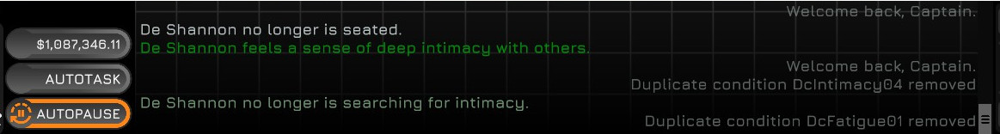

# Ostranauts De-duplicator

Ostranauts De-duplicator is a BepInEx plugin that runs just after you load your save and scans the player condition list for duplicates. It uses a basic heuristic to determine if two conditions are equal since conditions can have magnitudes baked into their names, for example `DcFatigue01` and `DcFatigue02` are the same condition with different names and would be detected.

> [!IMPORTANT]  
> This plugin's whitelist is a WIP and neither perfect nor complete at this time. When you start a new game you may see "Removed duplicate condition" in the log for your player character. If it looks like something important was removed, exit the game without saving and disable the mod, then report the condition that was removed in an issue or in the mod's thread in the Ostranauts discord server.

## Installing

- Download BepInEx v5.4.23.2 WINx64: <https://github.com/BepInEx/BepInEx/releases/tag/v5.4.23.2>

- Unzip all contents into `Ostranauts` root folder. It should contain now `BepInEx`, `winhttp.dll` & etc.

- Unzip the latest mod DLL into `Ostranauts/BepInEx/plugins`. I've packaged each release so that a plugins folder is at the top. You can drag this into your BepInEx folder and confirm overwriting existing files if you're updating. If the plugins folder doesn't exist, that's okay, normally BepInEx creates this folder for you the first time you run the game after installing it but you can also just drop it in from my release and it will work fine

- Launch game and confirm BIE is loading plugins by checking the `Ostranauts/BepInEx/LogInfo.txt` file. You should see the following

```plaintext
[Info   :Deduplicator] Plugin Deduplicator version x.x.x is loaded!
[Info   :Deduplicator] Registering callbacks with CrewSim
```

## Media

### Conditions Being Removed



## Whitelist

As of the most recent release, only `DcAging` is whitelisted as its the only condition I've seen that seems to exist in multiple forms without issue.
